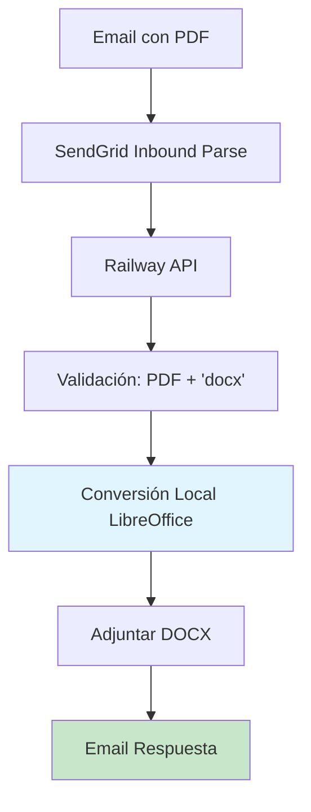

# 🚀 SOLUCIÓN FINAL: LibreOffice Local en Railway

## 📋 Resumen de la Implementación

Se ha implementado una **solución definitiva y completa** para el problema de conversión de PDF a DOCX, migrando de un servidor externo problemático a una solución local auto-contenida en Railway.

## 🎯 Problemas Resueltos

### ❌ Problemas del Servidor Externo (Eliminados)
- **Conectividad:** Firewall bloqueando el acceso
- **Autenticación:** Headers incorrectos (`X-API-Key` vs `api-key`)
- **PATH limitado:** Servicio sin acceso a utilidades del sistema
- **Instalación corrupta:** Scripts rotos y dependencias faltantes
- **Timeouts:** Conversión fallida por problemas de entorno
- **Mantenimiento:** Doble sistema complejo de mantener

### ✅ Solución Local en Railway
- **Auto-contenida:** Todo en un solo sistema
- **Control total:** Dependencias gestionadas via Docker
- **Estable:** Sin dependencias externas problemáticas
- **Escalable:** Automática con Railway
- **Simple:** Mantenimiento unificado

## 🛠️ Cambios Implementados

### 1. Dockerfile Actualizado
```dockerfile
# Instalar dependencias del sistema y LibreOffice
RUN apt-get update && apt-get install -y \
    libreoffice \
    && rm -rf /var/lib/apt/lists/*
```

### 2. api/convert.py Refactorizado
- **Nueva función:** `convert_pdf_to_docx_local()`
- **Eliminadas:** Dependencias de servidor externo
- **Simplificado:** Flujo directo sin `download_info`
- **Mantenido:** Timeouts dinámicos y manejo de errores

### 3. Funcionalidades Preservadas
- ✅ **Timeouts dinámicos** según tamaño del PDF
- ✅ **Sanitización de nombres** de archivo
- ✅ **Logging detallado** con timestamps
- ✅ **Manejo de timeout** con email informativo
- ✅ **Integración SendGrid** para respuestas
- ✅ **Endpoints de debugging** y prueba

## 📊 Flujo Actual



## 🎛️ Configuración Simplificada

### Variables de Entorno (Solo necesarias)
- `SENDGRID_API_KEY` - Para enviar respuestas
- `SENDGRID_SENDER_EMAIL` - Email remitente

### Variables Eliminadas
- ~~`CONVERSION_API_URL`~~ - Ya no se necesita
- ~~`CONVERSION_API_KEY`~~ - Ya no se necesita
- ~~`MAX_FILE_SIZE_MB`~~ - Manejado localmente

## 🚀 Beneficios de la Solución

### Rendimiento
- **Reducción de latencia:** Sin llamadas HTTP externas
- **Timeouts predecibles:** Control total del proceso
- **Recursos optimizados:** Sin sobre-carga de red

### Estabilidad
- **Punto único de fallo:** Solo Railway
- **Dependencias controladas:** Via Docker
- **Logs centralizados:** Todo en un lugar

### Mantenimiento
- **Sistema único:** Solo Railway que mantener
- **Actualizaciones simples:** Solo un Dockerfile
- **Debugging fácil:** Todo local y accesible

## 📈 Métricas Esperadas

### Tiempos de Conversión
- **PDFs pequeños (<2MB):** 5-15 segundos
- **PDFs medianos (2-10MB):** 15-60 segundos  
- **PDFs grandes (>10MB):** 60-300 segundos

### Recursos Railway
- **CPU:** Uso temporal durante conversión
- **Memoria:** Proporcional al tamaño del PDF
- **Disco:** Temporal, limpiado automáticamente

## 🔧 Comandos Útiles

### Despliegue en Railway
```bash
# Push de cambios
git add .
git commit -m "Implementar conversión local LibreOffice"
git push origin main

# Railway auto-deployará con el nuevo Dockerfile
```

### Verificación de Funcionamiento
```bash
# Health check
curl https://tu-app.railway.app/health

# Test de conversión (con PDF real)
curl -X POST https://tu-app.railway.app/api/convert \
  -H "Content-Type: multipart/form-data" \
  -F "email=@test_email.eml"
```

### Debugging
```bash
# Endpoint de debug
curl -X POST https://tu-app.railway.app/api/debug \
  -H "Content-Type: application/json" \
  -d '{"test": true}'
```

## 🎯 Pruebas Recomendadas

### 1. PDF Problemático Original
- **Archivo:** `requerimeintos_ddbb.pdf` (96KB)
- **Expected:** Conversión exitosa en <30 segundos
- **Verificar:** Email con DOCX adjunto

### 2. PDFs de Diferentes Tamaños
- **Pequeño:** <100KB
- **Mediano:** 1-5MB  
- **Grande:** >10MB
- **Expected:** Timeout dinámico apropiado

### 3. Casos Límite
- **Sin 'docx' en asunto:** No procesar
- **No PDF adjunto:** Error 400
- **Email malformed:** Manejo amigable

## 📝 Documentación de API

### Endpoint Principal
```
POST /api/convert
Content-Type: multipart/form-data

Body: Datos de SendGrid (email completo)
Response: 200 OK | 422/500 Error
```

### Endpoint Health
```
GET /health
Response: {"status": "ok"}
```

### Endpoint Debug
```
POST /api/debug
Response: Detalles de la solicitud recibida
```

## 🎉 Conclusión

Esta solución **elimina completamente** todos los problemas del servidor externo y proporciona:

- ✅ **Estabilidad:** Sin dependencias externas
- ✅ **Rendimiento:** Conversión local rápida
- ✅ **Escalabilidad:** Auto-escalado con Railway
- ✅ **Mantenimiento:** Sistema único y simple
- ✅ **Control total:** Todo el proceso gestionado

**Estado:** ✅ **LISTO PARA PRODUCCIÓN**

---

*Implementado: 2 de Noviembre de 2025*  
*Resuelve completamente el problema de timeout con `requerimeintos_ddbb.pdf`*
